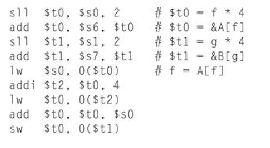

Joshua Ferguson

# Assignment 2

## 2.1 [5] <§2.2> For the following C statement, what is the corresponding MIPS assembly code? Assume that the variables f, g, h, and i are given and could be considered 32-bit integers as declared in a C program. Use a minimal number of MIPS assembly instructions. 

## f = g + (h – 5); 

sub i,h,5

add f,g,i

## 2.3 [5] <§§2.2, 2.3> For the following C statement, what is the corresponding MIPS assembly code? Assume that the variables f, g, h, i, and j are assigned to registers $s0, $s1, $s2, $s3, and $s4, respectively. Assume that the base address of the arrays A and B are in registers $s6 and $s7, respectively. 

## B[8] = A[i–j]; 

sub $t0, $s3, $s4

sll $t0 , $t0, 2

add \$t1 ,$t0, $s6

sw \$t1, 32($s7)

## 2.4 [5] <§§2.2, 2.3> For the MIPS assembly instructions above, what is the corresponding C statement? Assume that the variables f, g, h, i, and j are assigned to registers $s0, $s1, $s2, $s3, and $s4, respectively. Assume that the base address of the arrays A and B are in registers $s6 and $s7, respectively.



f=A[f];

f=A[f+1]+A[f];

B[g]=f;

## 2.15 [5] <§§2.4, 2.5> Provide the type and hexadecimal representation of following instruction: sw \$t1, 32 \$t2) 


I-Type : used by the immediate and data transfer instructions

machine code:

101011 01010 01001 00000 00000 100000

hex:

0xAD490020

## 2.17 [5] <§2.5> Provide the type, assembly language instruction, and binary representation of instruction described by the following MIPS fields:

## op=0x23, rs=1, rt=2, const=0x4 

I type

lw $v0, 4(\$at)

100011 00001 00010 0000000000000100

## 2.26 Consider the following MIPS loop:

```Assembly

LOOP: slt $t2, $0, $t1 
beq $t2, $0, DONE 
subi $t1, $t1, 1 
addi $s2, $s2, 2 
j LOOP 
DONE: 

```

### **2.26.1 [5] <§2.7> Assume that the register $t1 is initialized to the value 10.What is the value in register $s2 assuming the $s2 is initially zero? **

20

### **2.26.2 [5] <§2.7> For each of the loops above, write the equivalent C code routine. Assume that the registers $s1, $s2, $t1, and $t2 are integers A,B, i, and temp, respectively. **

```C

for (int i =10;i > 0;i--)
{
    B+=2;
}
```

### ** 2.26.3 [5] <§2.7> For the loops written in MIPS assembly above, assume that the register $t1 is initialized to the value N. How many MIPS instructions are executed? **

number of statements*number of iterations+ number of conditionals

5*10+2=52
